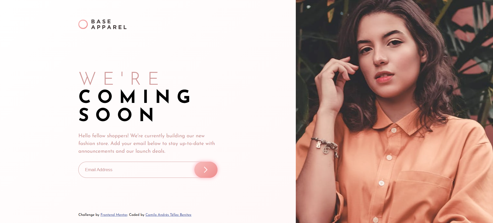

# Solución al reto: Base Apparel "coming soon" page

Esta es una solución al reto de [Base Apparel coming soon page challenge on Frontend Mentor](https://www.frontendmentor.io/challenges/base-apparel-coming-soon-page-5d46b47f8db8a7063f9331a0).

## Tabla de contenidos

- [Descripción](#descripción)
  - [El reto](#el-reto)
  - [Captura de pantalla](#captura-de-pantalla)
  - [Enlaces](#enlaces)
- [Mi proceso](#mi-proceso)
  - [Tecnologías utilizadas](#tecnologías-utilizadas)
- [Autor](#autor)

## Descripción

### El reto

Los usuarios deben ser capaces de:

- Ver el diseño óptimo de la página, independientemente del tamaño de la pantalla del dispositivo.
- Ver los estados al pasar el cursor sobre todos los elementos interactivos de la página.
- Recibir un mensaje de error al enviar el formulario si:
  - El campo de entrada está vacío.
  - La dirección de correo electrónico no tiene el formato correcto.

### Captura de pantalla

A continuación, muestro el resultado del proyecto en una pantalla de escritorio:

### Enlaces

- URL del proyecto publicado: [Ver sitio en GitHub Pages](https://camilo-atb.github.io/Base-Apparel-coming-soon-page/)

## Mi proceso

### Tecnologías utilizadas

- **HTML5 semántico** para una estructura clara y accesible.
- **Propiedades personalizadas de CSS** para mantener consistencia en los estilos.
- **CSS Grid**
- **Flexbox** para manejar los diseños flexibles y adaptables.
- Enfoque **mobile-first** para garantizar una buena experiencia en dispositivos móviles.
- Validación con **JavaScript puro**.

## Autor

- LinkedIn - [Camilo Andrés Téllez Benítez](http://www.linkedin.com/in/camilo-téllez)
- Frontend Mentor - [@camilo-atb](https://www.frontendmentor.io/profile/camilo-atb)
- YouTube - [Camilo Téllez](https://www.youtube.com/@camilotellez887)

Gracias por visitar este proyecto 💖  
¡Espero que te haya gustado! Si tienes sugerencias o comentarios, no dudes en compartirlos.
